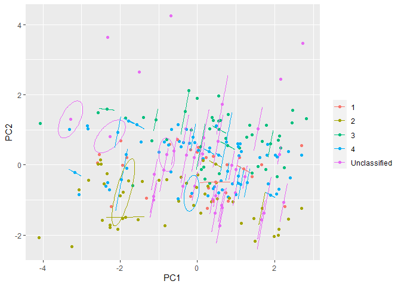
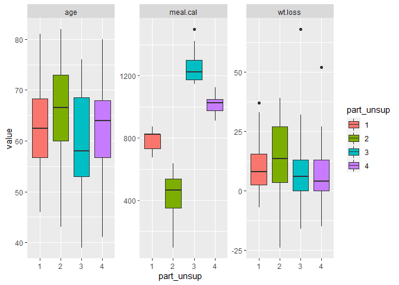
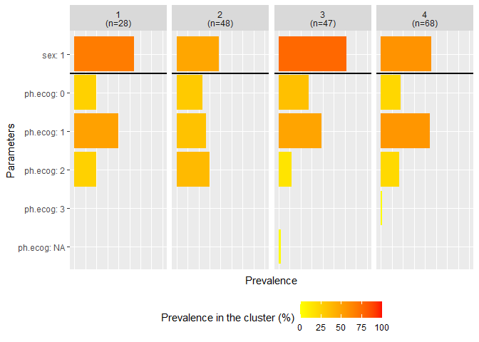
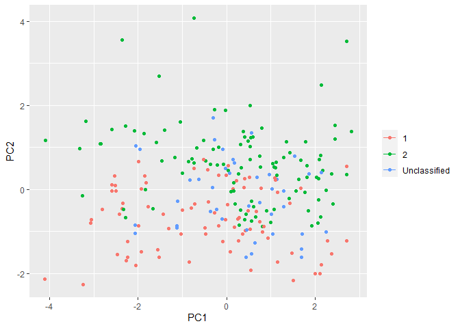
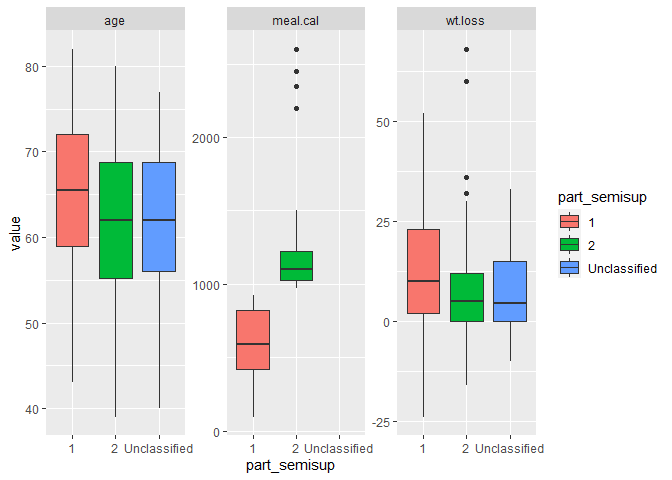
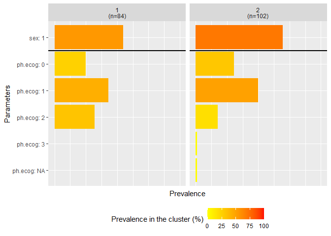

<!-- README.md is generated from README.Rmd. Please edit that file -->

# doMIsaul 

<!-- badges: start -->

[](https://lifecycle.r-lib.org/articles/stages.html#experimental)
[](https://github.com/LilithF/doMIsaul/actions)
<!-- badges: end -->

## Overview

The goal of package is to provide function to perform unsupervised and
semisupervised learning for an incomplete dataset.

## Installation

<!-- You can install the released version of doMIsaul from -->
<!-- [CRAN](https://CRAN.R-project.org) with: -->
<!-- ``` r -->
<!-- install.packages("doMIsaul") -->
<!-- ``` -->

You can install the development version from
[GitHub](https://github.com/) with:

``` r
# install.packages("devtools")
devtools::install_github("LilithF/doMIsaul")
```

## Example

This is a basic example which shows you how to perform unsupervised
learning for an incomplete dataset:

``` r
library(doMIsaul)
data(cancer, package = "survival")
cancer$status <- cancer$status - 1
cancer <- cancer[, -1]

set.seed(1243)
res.unsup <- 
  unsupMI(data = list(cancer), Impute = "MImpute_surv", Impute.m = 10,
          cleanup.partition = TRUE, return.detail = TRUE)

cancer$part_unsup <- res.unsup$Consensus

plot_MIpca(res.unsup$Imputed.data, 1:228, color.var = cancer$part_unsup,
           pca.varsel = c("age", "sex", "ph.ecog", "ph.karno", "pat.karno",
                          "meal.cal",  "wt.loss"))
```



``` r
plot_boxplot(data = cancer, partition.name = "part_unsup",
             vars.cont = c("age", "meal.cal", "wt.loss"),
             unclass.name = "Unclassified", include.unclass = FALSE)
#> Warning: Removed 60 rows containing non-finite values (stat_boxplot).
```



``` r
plot_frequency(data = cancer, partition.name = "part_unsup",
               vars.cat = c("sex", "ph.ecog"))
```



This is a basic example which shows you how to perform semisupervised
learning for an incomplete dataset with a survival outcome:

``` r
## With imputation included
set.seed(345)
res.semisup <- 
  seMIsupcox(X = list(cancer[, setdiff(colnames(cancer), "part_unsup")]),
             Y = cancer[, c("time", "status")],
             Impute = TRUE, Impute.m = 10, center.init = TRUE,
             nfolds = 10, center.init.N = 50, 
             cleanup.partition = TRUE, return.detail = TRUE)
# This is an example, a larger value for center.init.N is recommended.

cancer$part_semisup <- res.semisup$Consensus[[1]]

plot_MIpca(res.semisup$Imputed.data, NULL, color.var = cancer$part_semisup,
           pca.varsel = c("age", "sex", "ph.ecog", "ph.karno", "pat.karno",
                          "meal.cal",  "wt.loss"))
```



``` r
plot_boxplot(data = cancer, partition.name = "part_semisup",
             vars.cont = c("age", "meal.cal", "wt.loss"),
             unclass.name = "Unclassified", include.unclass = TRUE)
#> Warning: Removed 61 rows containing non-finite values (stat_boxplot).
```



``` r
plot_frequency(data = cancer, partition.name = "part_semisup",
               vars.cat = c("sex", "ph.ecog"))
```



<!-- You'll still need to render `README.Rmd` regularly, to keep `README.md` up-to-date. `devtools::build_readme()` is handy for this. You could also use GitHub Actions to re-render `README.Rmd` every time you push. An example workflow can be found here: <https://github.com/r-lib/actions/tree/master/examples>. -->
<!-- Don't forget to commit and push the resulting figure files, so they display on GitHub and CRAN. -->

## Reference publications

You may find more details on the methods implemented in this package in
the associated publications:

-   Unsupervised MI learning: Faucheux L, Resche-Rigon M, Curis E,
    Soumelis V, Chevret S., Clustering with missing and left-censored
    data: A simulation study comparing multiple-imputation-based
    procedures. Biometrical Journal. 2021; 63: 372– 393.
    <https://doi.org/10.1002/bimj.201900366>
-   Semisupervised MI learning for a survival outcome: Faucheux L,
    Soumelis V, Chevret S., Multiobjective semisupervised learning with
    a right-censored endpoint adapted to the multiple imputation
    framework. Biometrical Journal. 2021; 1– 21.
    <https://doi.org/10.1002/bimj.202000365>

<!-- + add ref to COVID when published as an ex of application -->
